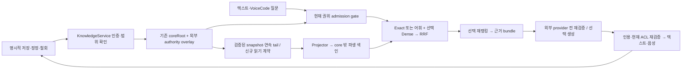

# #1165 지식 축적·검색·텍스트/음성 경험 통합 설계
Binding: task #1165 | sid kuc1165-architect | attempt 4cd7ea2a-2297-46e1-bd93-fad31c9f48fa | operation kuc1165-synthesis-v2.
상태: 컨트롤러 검토용 **설계 제안**. Phase 1 독립 결과와 지정된 peer 초안을 통합했으며, 새 구현 승인은 아니다. 기존 릴리스 작업은 계속된다.
표기: **R** = 직접 재확인한 소스/호출 경로, **E** = Phase 1에서 받은 공식 근거, **P** = 제안, **U** = 미측정 런타임. 새 계약·UX·수락 수치는 전부 P다. Peer 초안 `f425a3138e01bc33bffc18cdecd868191ef2af57fa169275548c69ce98eef134`는 검토 입력이며 승인 권위가 아니다.
**현행 개정 우선순위 (2026-09-13):** task #1165 | sid srv1165-architect | attempt 1b7f466d-2024-45a8-8681-4e09d8851150 | operation srv1165-v1. 사용자 “서버 구성을 가장 높은 우선순위” 지시에 따라 본 문서가 현재 아키텍처 SSOT다. 위 Binding과 R/E·소스 해시·테스터 수치는 원저자 kuc1165의 역사적 조사이며 이번 재감사가 아니다. 원본 SHA256 `8e0e59de67378ae4e95ce5e62cc62a035f560914c7540f15aada8f41e7dc4fb9`만 직접 재확인했다.
**대체 범위:** 원본 및 `2026-09-13-rag-open-source-selection.md`·`2026-09-13-ecosystem-ontology-architecture.md`의 PC 단일 프로세스/SQLite-first/서버 후순위 제안은 아래 서버 우선 P로 대체한다. 기존 안전·UX·저장 근거와 역사적 연구 표는 유지한다. 새 조사 S1–S5와 개정 판단은 srv1165 저작이며 설치·개인 자료 이관·구매·외부 provisioning·새 구현 승인은 포함하지 않는다.

## 1. 권고와 최소 제품 범위
**P:** 사용자는 기록을 폴더로 정리하는 대신 질문하고, 짧은 근거 답변에서 출처·결정 이력·정정으로 이동한다. 명시적 질문을 기본 진입점으로 하고, 프로젝트/작업 문맥 도움은 따로 켠 범위에서만 제공한다.
서버의 단일 논리 권위와 KnowledgeService API를 중심으로 텍스트·키보드·음성 어댑터가 같은 계약을 사용한다. 기본은 유지보수 가능한 단일 Linux 호스트의 모듈형 서비스다. 로컬 설치도 이 서버 스택을 검증하며 PostgreSQL·Qdrant는 아래 역할로 권고한다. Kubernetes·HA·필수 graphDB·RAG 프레임워크는 요구하지 않는다.
TaskAdvisor는 ON/제안만이다. 문맥 도움 OFF이면 사용자가 연 작업의 명시적 요청 안에서만 제안한다. TaskLoop는 OFF이며 별도 인간 활성화 없이는 실행하지 않는다. 질문, 저장된 승인문, 음성의 인용 재생은 실행 권한이 아니다.
PC+Galaxy Fold7/Buds2Pro는 목표 사용 환경이다. 전화기와 이어폰의 네이티브 지원·STT·TTS·백그라운드 동작·Bluetooth 버튼·지연·배터리는 U다. 질문 계약은 플랫폼에 종속되지 않되 실제 지원은 기기 수락 후 표기한다.
근거: E1–E3의 기대·설명·교정 원칙, E4–E6의 접근성, E7의 권한 분리, E8의 소유권. 이는 이 제품에서 검증된 최적성 주장이 아니다.
**최소 서버 우선 릴리스:** 인증된 권위 서비스에서 명시적 저장 → exact/어휘 검색 → 출처가 붙은 결정·원문 발췌 → 정정/철회 → 다음 답변 반영을 키보드·텍스트로 완결한다. U0–U2/U5의 Linux 운영 설치·복원·동시성·권한 검증과 로컬 동일 구성 검증이 선행한다. SQLite smoke만으로 통과하지 못하며 생성 모델 없이도 쓸 수 있어야 한다.
**전체 경험 목표:** U3에서 #1157 VoiceCode와 전화기/이어폰 경로를 검증해야 PC+phone·voice-only 목표가 충족된다. 최소 서버 릴리스만으로 전체 목표 완료를 보고하지 않는다. Dense/RRF, 재랭커, graph/entity 확장, 생성 문맥, 원격 LLM은 선택적 개선이다. 서버 배포 계약은 처음부터 기본이며 클라우드 계정은 전제하지 않는다.

## 2. 현행 소스와 런타임의 경계
**R:** authorized brain `src` contains 86 regular files; `BrainMcpServer.ts` has 27 literal tool-registration sites, while README says 26. Static count does not prove a successful bootstrap or installed tool count.
**R:** core SHA256 is `e6620b222fdb5dcd0064080e33fc70d74dbf790395ee9d7cbbd13e983246fff8`, matching dispatch. `ingest` validates logical owner/task/positive consent before copying input bytes; its caller must authenticate identities and consent authority.
Core occurrences are distinct from blob hashes; revisions are append-only, `authority=evidence-only`, `approved=false`; current anchors are original-byte ranges with exclusive end. `withdraw` denies scoped reads without physically deleting evidence.
Core root contains `originals/<hash>`, `revisions/<UUID>`, `provenance/<sequence>.commit.json`, `store.json`, `publication.json`, `.lock`, plus transaction preparation artifacts. The strict allowlist rejects arbitrary new subdirectories.
Checkpoint checks reject a missing final committed tail; coherent restoration of the entire store AND matching old checkpoint is outside that defense. Never reconstruct a trusted checkpoint from surviving files to claim recovery.
**R, synthesis recheck:** `transaction():513–552` locks every operation; `load():587–632` enumerates objects, replays all commits and verifies all committed original/revision blobs, including on reads. Let S be referenced bytes read per replay (counting repeated blob references), N objects/events: full reads/hashing are O(S)+O(N) checks, plus commit sorting; sequential equal-sized independent additions imply quadratic cumulative verification work. This is code-derived complexity, not measured latency or proof of which cost dominates.
**R:** package.json declares Node `>=20`, no SQLite runtime dependency; `rg -i sqlite` in src/package finds only an EntityGraph vocabulary entry. No usable built-in driver was verified. ContentDedup splits whitespace/punctuation and drops length-one tokens; KoreanTokenizer is a separate EntityGraph seam with optional MeCab subprocess calls. Its security/runtime assumptions are not automatically reusable.
**R:** `brain_search → BrainContract.search → optional PolicyEngine.filterRead → entry-scope filter → hybridSearch`; MCP response projects entry text/scores, without this design's occurrence/revision/anchor/authorization proof contract.
`brain_context_resume` MCP accepts window/mode/confidenceThreshold, not query/policy. Its `ContextRestoreService.restore` reads ProfileManager, filters entry scope `user`, then selects default `current` recall and packs; this inspected route does not invoke `PolicyEngine.filterRead`.
`RecallPolicy` exposes current/none/vector/ledger/oracle in source; the vector rung calls hybridSearch without embedding context, so its name is not proof of neural retrieval. Oracle reads labels and must remain evaluation-only. DecisionLedger projects text, not authoritative human decisions.
`PolicyEngine` leaves team membership unenforced and checks allowed_models only when modelId exists; bootstrap supplies project/default scope, not modelId. Neither metadata nor caller-supplied identity is authentication.
Bootstrap passes `autoCapture:true` into BrainContract; MCP instructions encourage silent preference inference. A separate CaptureOrchestrator defaults off. Do not generalize that separate default to all capture; these routes are unsuitable defaults for this opt-in design.
HybridScorer has lexical/TF-IDF fallback and optional vector context; EmbeddingService can lazy-load an optional model. Bootstrap's inspected BrainContract construction supplies no embeddingIndex. ConfidenceGuard's 0.65 threshold averages scores, not truth probability.
No `LocalKnowledgeStore` reference was found under authorized brain `src`. README/package describe an existing external-dependency package; embedding optionality does not make the whole package dependency-free. Reuse small compatible functions in the shipped core; do not require installing brain/MCP for basic knowledge use.
**U:** actual authentication, approved-knowledge linkage, ACL-complete retrieval/resume, indexes, STT, restore, encryption/key recovery and server migration are not established. No real personal store is configured by this task.
Inherited tester report: 97 pass / 0 fail / 1 environmental skip for focused storage fixtures only; no rerun, full-product/build, real power-loss or security pass claimed. Historical no-implementation language was superseded only for the approved bounded storage slice.

| Reviewed source under `/Users/duckyoungkim/projects/aigentry-brain/` | SHA256 (R, 2026-09-13) | Relevant seam |
| --- | --- | --- |
| `src/mcp/BrainMcpServer.ts` | `271f9929215470b33862e6447d983267dd140802e32d6016a8cd0aa2e8e8e4f1` | 60, 179–248, 271–328: instructions and MCP inputs/outputs |
| `src/mcp/BootstrapOrchestrator.ts` | `b1881002e014e365b2072fce36f679eb0eb956564b5b707f5892f159812136df` | 180–200: actual constructor arguments |
| `src/contract/BrainContract.ts` | `717640af0058560e796acb1bb9201698d415688a3025f1d21a46c81fddf42925` | 201–218, 257–267, 304–325, 364–370: policy/search/restore |
| `src/context/ContextRestoreService.ts` | `3ab4c7fc04e3d5722bd2d7a874fe4b61ea6f0e6e99dac58fb1fae0d42e558d5c` | 309–375: candidates, recall and packing |
| `src/policy/PolicyEngine.ts` | `c81c5370c78dc6c2af943d31835b6ba06f3622d536364357c34a34cca1971d06` | filterRead and its conditional model check |
| `src/search/HybridScorer.ts` | `22200211a1524dd48a06086bb4621a8aa8550203f7db9682a33f801f3fe11252` | ranking and TF-IDF fallback |
| `src/recall/RecallPolicy.ts` | `f437fe8c10762b066ca57a9272c0beb5dbc3b922f359aed1a1fdca9747eef9d8` | default current, vector without embedding context, eval oracle |
추적 식별자: `kuc1165-v1/source-manifest.json`, `state/dispatch/inbox/2026-09-13-kuc1165-phase1-REPORT.md`, `state/dispatch/inbox/2026-09-13-krx1165-REPORT.md`. 위 표와 본문 공식 URL은 main의 같은 docs/specs 경로에서도 자족적으로 남는다. 전체 파일 해싱은 전체 의미 검토가 아니다. Base `6f515931c0d1967ffbe8eb0464a96292030a1f6d`는 dispatch 값이며 실제 HEAD/전체 dirty 상태는 Git 금지로 미측정이다. 최초 지정 문서/admin은 없었다.

## 3. 공식 근거 — English evidence analysis
All E entries fetched **2026-09-13** in Phase 1, official primary pages, paraphrased; no quoted passages. Applicability decisions are P. Provenance identifier `kuc1165-v1/EVIDENCE.md` records public raw bodies/extracts. Phase 2 performs no new fetches; peer retrieval findings are attributed to the draft/report above, with the controller's corrections taking precedence.

| ID / exact primary source | Narrow finding | Limitation |
| --- | --- | --- |
| E1 [Microsoft HAI paper](https://www.microsoft.com/en-us/research/publication/guidelines-for-human-ai-interaction/) | 18 guidelines evaluated with 49 practitioners against 20 products support lifecycle-oriented UX review. | Abstract inspected, not a Fold7 study or product guarantee. |
| E2 [PAIR Explainability + Trust](https://pair.withgoogle.com/chapter/explainability-trust/) | Data sources, capability limits and situation-appropriate explanations help calibrate trust. | Explanations can be wrong; guidance is not a confidence calibration metric. |
| E3 [PAIR Feedback + Control](https://pair.withgoogle.com/chapter/feedback-controls/) | Explain feedback scope/time to effect; engagement may not express preference. | No mandate for implicit collection or immediate model retraining. |
| E4 [W3C Status Messages](https://www.w3.org/WAI/WCAG22/Understanding/status-messages.html) | Non-focus status changes need programmatic exposure; excessive announcements can interrupt. | Informative SC 4.1.3 guidance, not complete WCAG conformance. |
| E5 [W3C Error Identification](https://www.w3.org/WAI/WCAG22/Understanding/error-identification.html) | Identify erroneous input and describe the error in text. | SC 3.3.1 addresses input errors; broader recovery UX is our extension. |
| E6 [W3C Keyboard](https://www.w3.org/WAI/WCAG22/Understanding/keyboard.html) | Provide keyboard operation without timed keystrokes, subject to the path-dependent exception. | Does not certify voice, Bluetooth or Android integration. |
| E7 [OWASP LLM01](https://genai.owasp.org/llmrisk/llm01-prompt-injection/) | Retrieved/multimodal data can inject instructions; RAG alone cannot prevent it; restrict privileges in code. | Mitigations are layered, not a complete defense. |
| E8 [Ink & Switch Local-first](https://www.inkandswitch.com/essay/local-first/) | Local storage, offline work, ownership and multi-device collaboration are design ideals. | Does not solve this product's current-ACL consistency or key recovery. |
| E9 [RAGAs paper](https://aclanthology.org/2024.eacl-demo.16/) | Evaluate context relevance/focus, faithful use and answer quality separately. | Abstract inspected; reference-free scores are proxies, not human truth or an adopted dependency. |
| E10 [ALCE paper](https://aclanthology.org/2023.emnlp-main.398/) | Evaluate fluency, correctness and citation quality separately. | Abstract inspected; reported corpora/results do not measure Korean personal knowledge. |
| E11 [PAIR Errors + Graceful Failure](https://pair.withgoogle.com/chapter/errors-failing/) | Distinguish context/system errors, state limits and provide a way forward. | Guidance does not establish error detection accuracy or acceptable product latency. |
| I1 [SQLite FTS5](https://www.sqlite.org/fts5.html), [Qdrant hybrid queries](https://qdrant.tech/documentation/concepts/hybrid-queries/), [Anthropic contextual retrieval](https://www.anthropic.com/news/contextual-retrieval) | Inherited peer/controller retrieval references for planned searchable-text indexing, rank fusion and separately labeled generated chunk context. | Not fetched in Phase 2; no benchmark gains transferred, driver/runtime support inferred, or Qdrant/Anthropic dependency adopted. |
Fetch notes: web-tool transport failed; bounded direct HTTP worked. PAIR homepage was a JS shell; chapter pages were readable. Original local-first URL meta-refreshed to E8. [HAX overview](https://www.microsoft.com/en-us/haxtoolkit/ai-guidelines/) was also read; no detailed design-library/PDF inspection claimed. Supplied PAIR v2 alternative was unnecessary and not fetched.

**서버 개정 근거 S1–S5:** 2026-09-13 공식 문서 5개를 지정 curl로 HTTP 200 본문 확인했다. Qdrant의 두 이전 주소는 같은 문서의 redirect이며 추가 조사 문서가 아니다. URL·응답·본문/해시·최소 발췌·한계는 `.aigentry-report-srv1165/EVIDENCE.md`에 보존한다. 아래 기능은 upstream 설명, 적용은 P다.
| 근거 / 정확 URL | 확인 주장 / 한계 |
| --- | --- |
| S1 [Docker Compose production](https://docs.docker.com/compose/how-tos/production/) | 동일 Compose 정의와 환경별 override로 단일 서버 배포 가능. aigentry의 설치/운영 자동화 성공 증거는 아님. |
| S2 [PostgreSQL backup](https://www.postgresql.org/docs/current/backup.html) | SQL dump·filesystem backup·continuous archiving의 세 방식 설명; 조회 페이지 표기는 18. core/blob와의 일관성·RPO/RTO는 별도 설계이며 배포 버전 선정 아님. |
| S3 [Qdrant security](https://qdrant.tech/documentation/security/) | self-hosted 기본 인증/암호화 부재, API key·network bind·TLS·least privilege 설정 필요. 제품 tenant/occurrence ACL·현재 권위 보장과 다름. |
| S4 [AWS S3 integrity](https://docs.aws.amazon.com/AmazonS3/latest/userguide/checking-object-integrity.html) | 객체 업로드/다운로드 checksum 검증 기능. AWS S3 설명만 확인했으며 타 backend 호환·우리 SHA256 provenance/atomic commit 증거 아님. |
| S5 [Docker multi-platform](https://docs.docker.com/build/building/multi-platform/) | 복수 플랫폼 이미지·native/emulation/cross-compilation 경로와 에뮬레이션 비용 설명. 선택 이미지의 arm64 제공·실기기 성능은 미검증. |

## 4. 서버 기본 구조·저장 경로·읽기 계약 (P)
책임은 **EvidenceStore** 원본/이력, **KnowledgeService** 인증·현재 권위·검색·답변 검증, **presentation adapters** 입출력으로 유지한다. 배포 단위는 API, 동일 코드/이미지의 별도 ingestion/projector worker 역할, PostgreSQL, Qdrant와 blob 영속 볼륨이다. API는 유일한 사용자 데이터 진입점이고 headless로 동작하여 cmux/GUI/특정 CLI에 의존하지 않는다.
**확정 권고 역할(미설치):** PostgreSQL은 tenant/project 메타데이터·ACL/동의/검토/정정해소 overlay·job/outbox·동시성 제어의 내구성 저장소, Qdrant는 재구축 가능한 sparse/dense 검색 서비스다. PostgreSQL 추가는 기존 EvidenceStore를 **보강**하며 원본 occurrence/revision/hash/commit/byte anchor와 append-only provenance를 SQL로 자동 이관/대체하지 않는다. 검토 권위는 인증된 원권위 계약에서만 오며 SQL 행·graph·검색 payload가 승인이나 실행 권한을 발급하지 않는다.
신규 설치 예: `appDataRoot/evidence/ = coreRoot`, `appDataRoot/knowledge/ = PostgreSQL 볼륨 등 overlay 영속 경로`, `appDataRoot/indexes/ = Qdrant/파생 색인 볼륨`; 실제 DB 데이터는 해당 서비스만 소유한다. 백업 목적지는 별도다. 기존 설치의 **설정된 coreRoot는 그대로** 두고 신규 볼륨은 그 밖 명시적 allowlist 경로에 둔다. 기존 source layout·repo root를 재작성하지 않는다.
기존 `originals/`, `revisions/`, `provenance/`, `store.json`, `publication.json`, `.lock`는 coreRoot 안에 유지한다. strict allowlist 안에 knowledge/indexes를 넣거나 자동 wrapping·이동·schema migration·installer 재작성을 하지 않는다.
Overlay는 정확한 occurrence/revision/commit과 자체 committed sequence/hash를 보존한다. 파생 공개는 검증된 core와 overlay checkpoint 둘에 결속한다. 두 commit 사이 중단은 hidden/pending projection으로 남고 core의 `approved=false`를 바꾸지 않는다. 교차 루트 일관성·복구는 신규 검증 대상이다.

**신규 읽기 선행조건:** `readCommittedSnapshot` / `readCommittedTail(afterSequence, afterHash)`는 제안 명칭이며 현행 API가 아니다. 처음에는 기존 transaction의 전량 checkpoint/blob 검증을 그대로 수행한 뒤 인증된 snapshot과 연속 tail을 한 번에 반환한다. 배치가 호출 횟수를 줄여도 ingest의 누적 검증 비용이나 마지막 권한 재검사의 전량 비용은 사라지지 않는다.
반환 계약은 `store_identity, snapshot_id, core_sequence/hash, overlay_identity/sequence/hash, parent_lineage, verified_objects, effective_authority`에 결속한다. Projector는 준비 파일/임의 파일 스캔 대신 이 검증된 입력만 소비한다. 재시작·동시 변경·checkpoint 불일치·검증 실패 시 기존 전량 검증 또는 차단으로 돌아간다.
신뢰할 수 있는 **AuthorityReadModel**과 snapshot 유효기간/변경 감지·단일 writer 조정·출력 admission 직렬화가 추가 선행 작업이다. 최신 권위와 모든 committed 객체 무결성을 현재 의미대로 입증하지 못하면 전량 재검증 비용을 유지한다. 캐시된 snapshot/epoch만으로 이를 생략하지 않는다. 전량 검증을 periodic/accessed-blob 검증으로 완화하는 안은 별도 위협 모델 결정이며 이 설계에 몰래 포함하지 않는다.
**검색 기본:** Qdrant를 서버 검색 기본 후보로 채택하고 exact ID 조회와 검증된 bounded lexical fallback은 KnowledgeService에 유지한다. 한국어 sparse 생성·dense 모델은 aigentry 파생 작업의 책임이며 Qdrant 자체 품질로 가정하지 않는다. SQLite FTS5는 선택 비교/제한 환경 fallback일 뿐 초기 정본 배포가 아니다. Node >=20은 SQLite/PostgreSQL/Qdrant 번들 가용성을 뜻하지 않는다.
**검색 본문/공개 계약:** `chunk_text(original_text, normalized_text)`와 `chunk_meta(chunk_id, occurrence_id, revision_id, offsets, chunker_version, dependencies)`는 파생물이다. PostgreSQL의 projector 상태와 Qdrant에는 단일 SQL transaction이 없으므로 미공개 generation에 멱등 upsert → 전체 본문/메타/연속 commit 검증 → PostgreSQL 공개 manifest commit 순서로 처리한다. 중단·불완전 generation은 검색 불가이며 재시도로 회복한다. API는 검증된 generation만 질의한다. 선택 FTS5 구현은 실제 본문 external-content와 meta/checkpoint를 같은 색인 transaction으로 묶고 offsets-only FTS를 금지한다.
복사 본문·term index·embedding·cache는 민감한 재구축 가능 파생물이며 원본 권위가 아니다. 정규화/생성 문맥은 원문과 분리하고 `context_generated, model/version, derivation`을 남긴다. 인용은 항상 검증된 원본/revision 위치로 연결한다. live PostgreSQL/선택 SQLite WAL 디렉터리의 단순 복사를 일관된 백업이라고 하지 않는다.
**연속 적용:** `applied_sequence/hash`는 같은 lineage의 다음 commit을 순서대로 적용할 때만 전진한다. 멱등 chunk ID에는 occurrence/revision/offset/chunker-version을 포함한다. “철회 우선”은 trusted current-authority barrier가 색인 lag와 무관하게 노출을 먼저 막는 뜻이지, 중간 commit을 건너뛰고 sequence를 올리는 뜻이 아니다.
`index_meta`는 authority/store identity, 검증 checkpoint/lineage, tokenizer/chunker/embedding version, `vector_state=absent|stale|ready`, coverage와 lag를 기록한다. `index_epoch >= authority_epoch`만으로 신뢰하지 않는다. 최신 revocation 확인 불가·coherent old backup은 비활성이다. `require_fresh/min_commit_ref` 요청은 해당 정확한 이력이 보일 때까지 제한 대기 후 명시적 stale 상태로 끝낸다.
ID는 경로 변경에도 유지한다. KnowledgeService를 통하지 않는 legacy MCP/resume/export/stub은 같은 게이트 검증 전 이 저장소를 읽을 수 없다. PC/전화기는 서버 API의 입출력 어댑터이며 agent 간 전달은 telepty와 독립 접근 확인을 유지한다.

### 4.1. 영속 작업·blob·배포 동등성 (P)
**작업 계약:** PostgreSQL transaction에 인증된 intake intent/job/outbox를 먼저 기록하고, 기존 core는 단일 writer adapter가 직렬화한다. 멱등 키는 tenant/project + 수집 occurrence/request + operation/revision이며 blob hash만으로 중복 제거하지 않는다. core commit 뒤 정확한 receipt와 overlay/outbox 상태를 조정한다. cross-store crash의 모호한 commit은 검증된 tail에서 receipt를 대조할 때까지 pending/차단하며 blindly 재수집하지 않는다; 현행 core의 receipt 복구 가용성은 U1 선행조건이다.
Worker는 내구성 queued/running/committed/failed 상태, lease/fencing, 제한 재시도·backoff·deadletter와 인증된 재처리를 갖는다. 외부 broker는 기본에 추가하지 않는다. 정정/철회와 outbox는 overlay transaction에 함께 기록하되 현재 권위 barrier가 색인보다 먼저 노출을 차단한다. 재시작 중복/유실 방지는 검증 대상이며 exactly-once를 주장하지 않는다. 질문마다 전량 재색인하지 않고 연속 tail 작업으로 갱신한다. 전량 replay/hash 검증 비용 자체는 앞의 신규 읽기 계약 없이는 남는다.
**Blob 인터페이스:** 논리 hash/ref 기반 put-if-absent, verified get/range, manifest/backup, 명시 migration을 제공한다. 초기 단일 호스트 기본은 filesystem-backed 영속 볼륨이다. 기존 coreRoot 내부 형식/불변성은 유지하며 adapter가 현재 EvidenceStore를 감싼다. 동일 파일시스템 임시 쓰기→fsync→atomic rename 및 디렉터리 내구성, SHA256 재검증, 경로/symlink 제한, 소유권/최소 권한·중단 복구를 입증한 프로필만 허용한다.
**S3 backend:** 규모/원격 객체 저장이 필요할 때 동일 인터페이스의 별도 프로필로 구현한다. AWS S3 checksum 기능(S4)은 다른 S3-compatible 제품의 원자성·조건부 쓰기·range/multipart·권한/삭제 의미를 보증하지 않는다. MinIO/클라우드 제품을 자동 채택하지 않는다. 선택 backend별 라이선스·정확 API 호환 검증이 필요하며 core를 S3로 바꾸는 작업은 명시적 migration/read-contract 범위다.
S3 운영 프로필은 로컬에도 같은 API adapter와 버전/설정 계약을 사용한다. 승인된 로컬 emulator의 기능 차이를 기록하고 합성 데이터의 실제 목표 backend 계약/복원 검증을 별도 통과해야 한다. 에뮬레이터 통과를 운영 S3 동등성으로 보지 않는다. 초기 filesystem 운영 프로필은 로컬에서도 같은 filesystem 계약을 검증한다.
**동일 스택:** 기본 단일 호스트 Compose 배포 정의(S1)를 로컬/운영에서 공유한다. API schema, 서비스 이미지 release·각 architecture digest, 역할 topology, DB/record migrations·blob 계약은 같다. 차이는 endpoint/도메인/TLS trust, tenant 초기 설정, 볼륨 경로·용량, worker 수·자원 한도, secret 주입이다. 로컬은 loopback-only 공개이며 운영 데이터·비밀을 복제하지 않고 합성 자료를 쓴다.
§1/§17 적용: 서버 상태 동시성·검색 수명 분리 때문에 이 두 서비스를 도입하는 P이며 외부 플러그인/프레임워크는 요구하지 않는다. aigentry 설치물이 고정 구성과 lifecycle을 제공하는 것이 목표다. 특정 Docker Desktop/IDE/터미널 lock-in을 피하도록 동일 바이너리·API·migration의 Linux 서비스 관리자 배포 fallback도 계약화한다. Qdrant 장애는 exact/어휘로, 권위 DB 장애는 내용 없는 차단으로 처리하며 SQLite를 낡은 권위 대체물로 쓰지 않는다. 번들·라이선스·운영 fallback 검증 전 §17 충족을 주장하지 않는다.

| 지원 구분 — 모두 P/U | 최초 검증 대상·출시 조건 |
| --- | --- |
| 운영 서버 | Linux amd64 기본, arm64도 native image/DB/search/blob·복원 검증 후 지원; cmux/GUI 없는 headless 설치/upgrade 필수. 단일 호스트는 HA가 아니다. |
| 로컬 서버 검증 | Linux amd64/arm64, macOS arm64/x64·Windows x64는 Linux VM/container 경로로 동일 topology 검증. Docker Desktop 필수 아님; 미검증 조합은 지원 보류. |
| 클라이언트 | macOS arm64/x64·Windows x64·Linux amd64를 API/text/keyboard 대상, Linux arm64는 별도 패키징 gate. Android Fold7/Buds2Pro 음성은 U3 실기기 gate; Windows/macOS 네이티브 서버 지원과 혼동하지 않음. |
S5의 multi-platform manifest는 대상별 실행 성공 증거가 아니다. 각 pinned image의 linux/amd64·linux/arm64 제공 여부와 native/에뮬레이션 결과를 구분한다. 로컬 권위 서비스를 오프라인으로 실행할 수 있으나 연결 끊긴 보조 PC/폰은 현재 철회를 확인 못 하면 private cache/audio를 차단한다.

### 4.2. 서버 보안·운영·복원 (P)
서버 공개면은 TLS reverse proxy → KnowledgeService만 둔다. OIDC 또는 인증된 trusted identity adapter가 issuer/audience/expiry와 세션을 검증하고 tenant/project를 서버에서 결정한다. 클라이언트 principal/role 헤더나 저장된 승인문을 신뢰하지 않는다. proxy identity는 인증된 내부 경로에서만 수용한다. 모든 검색/scoring·외부 egress·출력/재생은 §9의 현재 권위 검사를 거친다.
PostgreSQL·Qdrant·object 관리 포트는 비공개 네트워크/최소 서비스 계정으로 제한하고 외부 bind를 금지한다. 컨테이너/worker는 nonroot·최소 capability·가능한 read-only root, blob/DB 쓰기 권한만 부여한다. secret은 이미지/repo 밖 주입하며 로그/백업에 평문 포함하지 않는다. 백업 암호화·접근·보존·키 복구 권한도 별도 통제한다. 이들은 제안 요구사항이며 wiring 증거가 아니다.
Liveness는 프로세스 생존, readiness는 schema 호환·검증된 권위/필수 저장소 접근을 확인한다. Qdrant 장애 시 검증된 lexical degraded 여부를 구분하고 권위 불명은 not-ready/차단한다. 요청 deadline·DB/검색/provider timeout·CPU/RAM/디스크 quota·bounded queue/backpressure를 둔다. 접수 거절과 committed 저장을 구분하고 사용자는 내구성 ingest 상태/실패 이유/허용 재시도를 조회한다.
감사는 무작위 request/operation ID, 권한 판단 결과, commit·job 상태, lag/실패율·자원/단계 지연을 남긴다. raw query/원문/음성·민감한 principal을 기본 로그/metrics label로 넣지 않으며 운영 관측 접근과 외부 전송도 통제한다. 기준 부하·RPO/RTO는 운영자와 합의하고 복원 훈련으로 측정할 목표이지 약속이 아니다.
**백업/복원:** 유지보수 창에 쓰기/worker를 멈추거나 검증된 공통 checkpoint barrier를 확보하여 core 원본/이력 + PostgreSQL metadata/authority/corrections/tombstones/jobs + blob refs를 하나의 버전 manifest에 묶는다. PostgreSQL 공식 백업 방식(S2)을 선택·고정하며 search snapshot은 선택이고 원천에서 재구축 가능해야 한다. 독립적인 최신 DB/옛 blob 조합은 복원 성공이 아니다.
Migration은 offline 또는 checkpointed·사전 백업 상태에서 별도 target에 복사→hash/schema/reference closure·최신 권위/복호화 검증→재색인→명시 cutover한다. 검증 전 source 유지, cutover 후 한 권위만 쓰며 후속 철회/기록까지 포함한 rollback을 검증한다. image만 내리는 rollback은 불충분하다. schema/record의 전후 호환·변환/복원 경로가 없는 upgrade는 차단한다.
릴리스는 버전과 architecture별 digest·SBOM·LICENSE/NOTICE·전이 의존성/모델 라이선스를 고정하고 floating latest를 금지한다. 정확 버전/최소 자원은 U0에서 결정하며 이번 최신 tag나 용량 실측을 발명하지 않는다. HA/replica/다중 호스트는 측정된 필요 뒤 같은 API·권위·migration 계약을 확장한다.

## 5. 축적·검토·권위 이력 (P)
`Idle → scoped intake request → consent/auth check → committing → stored evidence → extracting → queryable evidence`; 추출 실패는 `stored / processing unavailable`이며 committed 근거는 유지한다. 지속 저장 전에 명시적 scoped intake 동의를 확인하며 주변 소리/화면을 상시 수집하지 않는다.
사용자의 저장/공유/녹음 명령이 intake다. 표시된 standing rule은 선택한 프로젝트/작업 출처를 만료·철회까지 허용할 수 있으므로 매 저장마다 확인하지 않는다. 규칙 변경 시 대상 범위와 로컬/원격 처리를 알리고, 같은 수집 사건 재시도는 멱등 처리한다.
출처와 선택한 프로젝트/작업으로 메타데이터를 만들고 tag는 선택 사항으로 둔다. 폴더 이름·의무 분류는 필요 없다. 저장 commit 뒤에만 “저장됨 · 전사 중”, 이후 “검색 가능 · 검토 전 근거”를 조용히 알린다. Pending을 저장/승인 완료로 표시하지 않는다.
`queryable evidence → review needed → human decision recorded → accepted knowledge projection`은 추출과 별도다. 영향 큰 승격, 모순, 결정 변경, 중요한 전사 불확실성, 민감도/범위 변경만 검토 대상으로 삼으며 일상적인 승인된 수집·질의에는 승인 큐가 없다.
추출물은 출처 근거로 답할 수 있지만 승인된 프로젝트 정책이 되지는 않는다. 검토 큐는 관련 주장을 묶고 전후 내용·인용·영향·보류/정정/수용을 보여준다. 빈 일일 검토 의무는 없고 명시적 인간 정정에 같은 승인을 다시 요구하지 않는다.
Conversation memory는 별도 opt-in 저장 규칙을 가진 세션 문맥이다. 생성 답변이 다시 독립 근거가 되지 않게 원출처 의존성을 유지한다. 권위 있는 프로젝트 지식은 정확한 revision을 참조하는 내구성 인간 결정이 필요하다. “이 대화만”과 “이 프로젝트에 기억해”의 범위는 다르다.
추론된 취향은 출처/날짜가 있는 가설로 표시하고 “아니야 / 이번만 / 기억하지 마”로 교정한다. 개인화는 opt-in 전 OFF다. 클릭·재생·침묵·제안 거절을 동의나 영구 취향으로 해석하지 않는다. 개인화 OFF는 사용을 중단하며 이력을 몰래 삭제하지 않는다(E3).
알려진 `observed_at`, `recorded_at`, `valid_from/valid_to`, `decided_at`, `supersedes`, actor/scope를 기록하고 모르는 날짜는 모른다고 남긴다. 오래되어도 유효한 결정은 무관한 새 언급보다 중요하다. Recency는 검색 순서에만 영향을 주며 진실을 정하지 않는다.
상충하는 인간 결정은 새 scoped 인간 해소가 양쪽을 참조할 때까지 주체·시각·범위와 함께 미해결로 표시한다. 기계 재처리는 검토된 문장을 덮어쓰지 않고 경쟁 revision을 추가해 관련 projection을 pending으로 만든다. LWW나 fact>claim>inference 순위로 분쟁을 해소하지 않는다.

## 6. 질의·답변·상태 계약 (P; 미구현 논리 필드)
| Payload | 필수 의미 |
| --- | --- |
| Query | `schema_version, request_id, turn_id, mode={question,context_assist}, input={text,voice}, text, locale, project_id, task_id, source_selection, time_intent={as_of,current,history}, as_of?, output={brief,detail}, deadline_ms, cancel_id, require_fresh?, min_commit_ref?`; 문맥 참조는 정확한 원출처 revision을 전달한다. |
| Verified request context | 호스트가 인증한 `principal_id, device_id, effective_scope, purpose_id, consent_refs, provider_route, authorization_epoch`를 공급한다. 모델이 준 role/owner/ACL은 신뢰하지 않는다. identity/scope 누락은 검색 전 명확화/차단이며 침묵으로 프로젝트 범위를 넓히지 않는다. |
| Answer | `answer_id, request_id, generation_id, outcome={grounded,partial,clarify,no_result,blocked,unavailable}, brief, claims[{claim_id,text,kind,evidence_ids,temporal_status}], sources[], conflicts[], applied_corrections[], freshness{as_of,last_checked,index_generation}, uncertainty_reasons[], next_actions[], authority=evidence_only`; 점수는 진단값이며 “진실 %”가 아니다. |
| Evidence / reused context | `evidence_id, occurrence_id, revision_id, blob_hash, commit_ref, origin_label, actor?, recorded_at, valid_time?, approval_state, consent_revision, dependencies[], anchor`; snippet·출처 이름에도 현재 접근 권한이 필요하다. 재사용에는 이전 answer ID뿐 아니라 `derived_from`과 원근거를 붙인다. |
| Retrieval / Index | `retrievers[{name,rank,raw_score}], fused_rank, store_identity, authority_identity, verified_checkpoints, lineage, applied_sequence/hash, freshness_lag, vector_coverage, tokenizer/chunker/embedding_versions, degraded_stages`; epoch/lag 숫자만으로 권위를 증명하지 않으며 client가 보내는 값을 신뢰하지 않는다. |
| Anchor extension | `kind={byte,time,page,line,region}, target_revision, start/end, unit, mapping_revision, mapping_engine/version, verified`; 원본-byte 관계를 유지한다. 현행은 byte만 지원한다. 시간/페이지/줄/영역 map은 core 밖 파생 계층이며 검증 불가면 “위치 정보 없음”을 표시한다. |
| Status | `request_id, generation_id, seq, phase, code, message, retryable, next_action, progress_kind={indeterminate,measured}, progress?, authorization_state, updated_at`; 권한 확인 중에는 일반 상태만 알린다. 오래된 sequence/generation 갱신은 무시하고 차단 상태에 민감한 제목/개수를 싣지 않는다. |
| Voice packet | `answer_id, generation_id, packet_seq, claim_ids, evidence_ids, authorization_epoch, expires_at, playback_cursor, verified`; 전송 직전과 재생 직전에 정확한 의존성을 확인한다. Epoch/expiry는 무효화 메타데이터이지 현재 권위 검사의 대체물이 아니다. |
| Correction / withdrawal | 인증된 `request_id, actor`, `scope, target_occurrence/revision/claim, replacement_or_resolution, valid_time, reason?, idempotency_key`; 철회는 occurrence 의존성에 적용하며 blob hash로 삭제하지 않는다. Committed receipt와 영향받은 답변 상태를 반환한다. |
`Received → authenticating → resolving scope → retrieving → assembling → checking sources/authorization → answer ready → displaying/speaking → complete`; clarify/no-result/unavailable, cancel→cancelled, withdrawal/ACL change→blocked로 분기한다. Cancel은 generation·대기 출력을 무효화하며 이미 committed 정정/수집을 되돌리지 않는다.
확인 중에는 “권한과 근거를 확인하고 있어요” 같은 안전한 상태만 전달한다. 검증 전 사실 token이나 추측 음성을 stream하지 않는다. 정확한 접근 가능 span과 주장 범위를 확인하되 의미 검증의 실패 가능성을 인정하고, 근거가 애매하면 발췌/답변 보류로 낮춘다.

## 7. 검색 라우팅·단계별 공개·사용 여정 (P)
선택된 source/ID/decision은 **exact lookup fast path**로 조회한다. 넓은 관련 질문은 동일한 ACL/task/time 후보에 어휘 검색과 사용 가능한 선택 dense retrieval을 **병렬** 수행하고 RRF로 rank를 합친다. 어휘만 가능하면 그 결과를 쓴다. RRF k, candidate topK, 모델은 평가 전 고정하지 않는다. 검색 점수를 혼합해 진실 확률로 표현하지 않는다.
재랭커는 후보 정밀도를 높이는 별도 선택 단계다. Dense 검색과 같은 말이 아니다. Temporal 질문은 실제 결정·정정 관계와 유효 시점을 보존한다. 비싼 graph/entity 확장은 다중 출처 질문에서 측정된 가치가 있을 때만 켠다. 의도 불명은 범위가 제한된 어휘 검색/무확장 또는 한 번의 명확화로 처리하며 비싼 multi-source-summary로 보내지 않는다.
서버 sparse tokenizer/정규화·선택 dense는 한국어 조사·띄어쓰기·한영 코드·이름·부정어 gold로 평가하며 Qdrant가 형태소 분석을 제공한다고 가정하지 않는다. 선택 FTS5의 한글 토큰 색인은 형태소 분석과 다르며 unicode61/선택 stem/trigram을 비교한다. Trigram의 3자 미만 제한에는 exact/어휘 fallback을 둔다. 기존 KoreanTokenizer는 subprocess·범위·동의 경계 검토 후 재사용하며 삼중 색인을 필수화하지 않는다.
짧은 답변과 중요한 단서부터 보이고, 요청 시 출처 미리보기 → 결정 timeline → 모순 → 정정으로 펼친다. Known conflict를 token budget 때문에 숨기지 않는다. 범위를 다 담지 못하면 누락 범위를 밝힌 부분 답변을 주고, 상세 보기/재사용에도 현재 접근 권한을 재검증한다(E2/E9/E10).
**여정 A — “지난번 왜 이걸 선택했지?”** 사용자가 연 작업에서 “이걸”을 해석한다. 실제 후보 결정이 두 개 남으면 “로컬 저장 방식과 검색 방식 중 어느 결정인가요?”를 음성/텍스트로 묻는다. 무관한 프로젝트를 검색해 추측하지 않는다.
합성 예시: “당시에는 오프라인 접근과 데이터 소유권 때문에 로컬 저장을 골랐어요. 서버 이관은 보류했어요. 당시 결정 근거를 들을까요?” 미리보기는 결정·이유·대안·후속 변경을 열며, 과거 이유 설명이 현재 유효성까지 단정하지 않는다.
**여정 B — “이 회의 결정만 알려줘”** 선택된 meeting occurrence를 고정하고 확정 결정과 미해결 제안을 구분한다. 합성 예시: “이번 회의에서는 로컬 저장만 진행하기로 했어요. 서버 이전은 결정되지 않았어요. 결정 구간을 들을까요?” 검증된 time anchor 구현 전에는 인용 전사 구절을 읽고 위치 map 부재를 알린다.
**여정 C — “내가 정정한 내용으로 다시 답해줘”** 적용 가능한 committed 정정과 범위를 찾아 의존 답변을 무효화하고 현재 ACL로 재생성한다. “정정 반영됨”과 함께 “정정하신 대로, 선택 이유는 비용이 아니라 오프라인 접근이에요. 이전 기록과 정정 이력을 볼까요?”라고 답하는 합성 예시다. 정정이 없거나 모호하면 어느 문장인지 묻고 정정/모델 재학습을 꾸며내지 않는다.
**Opt-in 문맥 도움:** 명시적 프로젝트/작업 열기나 사용자가 요청한 handoff에서 허용된 rule과 선택 참조만 쓴다. 관련 이유와 닫을 수 있는 “관련 결정 1건”을 보여준다. 제안 한도는 작업 전환당 1건, 같은 작업/세션에서 거절 후 재노출 0건이다. 음성·키보드·터치로 중지/해제하며 상시 수집·요청하지 않은 음성은 없다.
도움 기능은 recall 향상을 위해 범위를 넓히지 않는다. 실행 제안은 제안으로 남는다. 이어지는 TaskLoop 활성화는 동작/대상/효과를 요약하는 별도 인증된 흐름이며 음성으로도 조작할 수 있다. 터미널에서만 확인하도록 만들지 않는다.

## 8. 음성·중단·접근성 (P)
사용자가 시작한 bounded listening에는 시작/종료 소리와 동등한 화면/screen-reader 상태를 제공한다. Raw audio 저장은 자체 intake 범위가 필요하며 STT 임시 buffer는 크기·수명을 제한한다. 결정/이름/부정어가 모호하면 해당 부분만 다시 묻고 사소한 표현까지 일괄 확인하지 않는다.
첫 음성은 핵심 결정·중요 단서·선택 상세 안내까지로 제한하고 길이 ≤15초를 제안한다. “근거 / 더 자세히 / 그만 / 다시 / 이어서 / 정정 / 이 작업 도움 꺼”는 같은 text/keyboard 동작에 대응한다. Headset gesture는 선택 편의이며 유일한 조작 수단이 아니다.
Barge-in은 재생을 멈추고 대기 packet을 취소한 뒤 bounded 입력 turn을 연다. “다시”는 권한을 재확인해 해당 문장을 재생하고 “이어서”는 문장 경계에서 짧은 문맥과 함께 잇는다. 결정/정정이 바뀌면 변경을 알리고 재생성하며 낡은 음성을 재생하지 않는다.
연결 끊김·통화·앱 background·audio route 변경은 출력을 멈추고 대기 private audio를 폐기한다. Buds에서 loudspeaker로 자동 전환하지 않는다. 재연결 뒤 명시적 이어듣기와 현재 인증/인용 검증이 필요하다. 중단 신호를 지원 못 하면 해당 기기 mode를 미지원으로 표시한다.
Screen reader에는 focus를 빼앗지 않는 programmatic status/live region을 제공한다. 단계 변경만 적절히 알리고 TTS와 겹치지 않게 조정한다. 매 token/점수/result를 읽지 않는다. 오류는 문제 입력과 해결 방법을 설명하고 keyboard focus/order·label을 안정적으로 유지한다(E4–E6).
미리보기·timeline·정정·취소/재생·검토 결정은 keyboard/text/voice 의도 동등성을 갖는다. Timeout은 미완성 입력을 보존하며 침묵을 동의로 해석하지 않는다. 음성이 인증을 우회하지 않으며 잠긴/미인증 기기에는 private 내용 대신 일반 상태와 접근 가능한 unlock 경로를 제공한다.

## 9. 개인정보·현재 권위·실패 대응 (P)
Content—including retrieved decisions, OCR, transcripts and previous answers—is untrusted data, never system instructions. Retrieval/generation has no actuation tools; allowlisted application code enforces capabilities and output destinations. Delimiting/sanitizing helps but does not prove injection resistance (E7).
LLM adapters are optional for any compatible provider, with the same evidence contract and capability checks; no promise that every model meets quality targets. Remote routing is OFF until scoped transfer approval identifies data/destination/purpose; provider timeout never switches provider or sends more data automatically.
Application gates run **before lexical/dense scoring**, **before every outside-provider egress** (including STT, embedding, reranker, generation and TTS), and **before each local/client output**. Scoring uses the currently authorized corpus/partition, not global private candidates followed only by result filtering. Derived dependencies include every contributing occurrence/revision/correction; recheck ACL/consent/tombstones on cache hit, direct read, preview, context packing, export and replay. Missing dependency proof denies output; invalidation cancels in-flight generation and queued display/audio.
Serialize authority checks with local delivery admission and cancel pending transport on change; keep device playback buffers minimal. Already delivered/displayed/heard or externally retained content cannot be erased, and a remote playback race cannot be wished away. Measure the stop boundary; do not call cached epochs instantaneous global revocation.
로컬 PC에서 동일 서버 스택을 실행하며 그 서비스가 유효한 ACL/tombstones를 가진 유일한 권위일 때만 오프라인 private 사용이 가능하다. 서버 권위에 접속하던 보조 PC/폰/replica는 단절 시 현재 권위를 입증하지 못하므로 재접속·재검증 전 private cache/audio를 차단한다. 두 설치를 동시에 권위로 활성화하지 않는다(E8 한계).
| Condition / ladder | User experience and recovery |
| --- | --- |
| Full permitted path | Grounded brief answer, sources and optional voice; provenance stays attached across devices/providers. |
| Optional semantic engine unavailable | Local lexical/direct-source retrieval, “기본 검색으로 찾았어요” only if material; no hidden download. |
| Generator/provider timeout or no LLM | Authenticated deterministic source excerpts/decision fields with “요약을 만들지 못해 근거를 보여드려요”; user can retry the same allowed route. No unsupported synthesis. |
| STT or TTS unavailable | TTS failure keeps text; STT failure offers a repeat/local available input or text. In voice-only use say the feature is unavailable through any functioning output and preserve pending intent; do not claim seamless offline speech without an engine. |
| Low relevance / no result | “현재 선택한 범위에서는 근거를 못 찾았어요.” Offer meeting/date/task clarification or explicit scope expansion. Distinguish no hits from system failure without exposing hidden records. |
| Stale / contradictory evidence | State the as-of date and unresolved difference first; show last decision and competing evidence, offer clarification. No silent latest-wins conclusion. |
| Offline authority unknown / withdrawn / denied | Generic content-free unavailable/blocked state; no cached private snippets or audio fallback. Reauthenticate/reconnect then run a new checked request. |
| Index lag / corrupt store / BUSY | Lag: show processing status and permitted core excerpts if valid. Corruption/checkpoint mismatch: withhold content, preserve files and show guided recovery; BUSY: bounded retry, never steal/delete a lock. |
Recovery UX names “저장소 확인 필요 / 다른 작업 사용 중”, offers retry, local diagnostic explanation and a controlled restore preview. No automatic lock removal, file deletion, checkpoint synthesis or private diagnostic upload; operator recovery requires establishing no active owner and validating committed history.

## 10. 정정·사용 중단·내보내기·복구 (P)
Correction preview identifies statement, target revision, scope and effective time; explicit correction commits append-only and invalidates dependent answers. Display/speak completion only after commit. Repeating the same request is idempotent; undo is another traced correction, not deletion of earlier human evidence.
“잊어줘” with an identifiable target defaults to stopping its use, described plainly as “앞으로 답변에 사용하지 않음”; clarify ambiguous targets. A committed withdrawal denies all dependent exposure immediately without waiting for index rebuild. Do not silently delete originals or imply erasure from listeners/providers/backups.
Personalization disable, memory-use withdrawal and physical deletion are distinct user intents. Destructive deletion remains unavailable until separately designed/approved; an export or migration never approves source purge. Re-consent must not resurrect a tombstoned occurrence through a byte-identical alias.
Export preview states selected scope, destination, included originals/revisions/decisions/corrections/consents/tombstones and encryption status. Propose a versioned manifest with relative logical refs, hashes, reference closure, both authority checkpoints and protected key-recovery metadata; never embed plaintext secrets/runtime grants. External export requires explicit transfer scope.
Recovery/cutover proposal: consistent single-writer snapshot → copy to separate roots → verify hashes/schema/reference closure and actual decryption with separately protected recovery key → merge trusted latest tombstones/decisions → rebuild indexes → explicit cutover. Unknown latest authority or failed key recovery blocks activation. Keep the source and a validated rollback path.
After cutover, only one side writes. Rollback must account for subsequent writes/withdrawals before activation; a coherent old backup cannot establish current truth. Authentication identity mapping is revalidated at the destination; PID/socket/token/lease/attempt grants are never exported as authority. Server transfer, backups and key recovery remain unimplemented/U.

## 11. 수락·평가 계획 (P; 모든 숫자는 미측정 목표)
Use a synthetic/versioned Korean+English corpus with owner/task ACLs, duplicate bytes/different occurrences, long meetings, negation/names, current and historical decisions, conflicting human corrections, withdrawal, broken anchors and text/image/audio injection. No personal datasets or paid/provider calls in this task.
Freeze train/dev/holdout by source lineage so corrected revisions cannot leak labels; include answerable and deliberately unanswerable questions. Gold records identify eligible evidence, exact supported claims/time, expected abstentions/conflicts and permitted actions. Human review adjudicates semantic support; automated judge scores remain secondary diagnostics (E9/E10).
동일 corpus와 생성 token budget에서 no-recall, bounded lexical, 서버 Qdrant sparse, 선택 dense+RRF, 선택 재랭커/decision projection을 ablation하며 FTS5는 비교군으로 남긴다. index 신선도·adapter/version을 기록하고 oracle은 production 비교에서 제외한다. 질의별/집단별 표본 수와 오차를 보고한다. 절대 gold 목표를 유지하면서 선택 개선의 recall@10/nDCG@10 저하 허용 한계는 제안 2 percentage points로 사전 등록하고 paired 불확실성을 확인한다. 개선 여지가 적으면 비용·지연 이득을 비교하며 peer의 보편적 상대 +15% 조건은 폐기한다.
| Evaluation slice | Proposed observable acceptance |
| --- | --- |
| Retrieval / temporal truth | ≥90% eligible-evidence recall@10 on ≥100 held-out queries; 100% of labeled conflicting-human-decision fixtures retain both sides or explicitly state incomplete evidence. |
| Grounded answers / anchors | ≥95% human-assessed support precision and ≥95% citation coverage of factual clauses; 100% emitted references resolve to the exact authorized revision/span. No unverified conclusion while checks are pending. These are release targets, not guarantees. |
| Correction / meaningful review | 100% of ≥30 scoped correction/reprocessing fixtures preserve prior history and use the effective correction or show unresolved conflict on the next completed answer; zero mandatory review dialogs for routine authorized intake/query. |
| Denial / withdrawal / injection | Zero unauthorized bytes in observed text/preview/cache/context/export/audio tests across ≥50 adversarial and race fixtures; every packet has current dependency checks; zero actuation from data or assistant suggestions. Any violation blocks release regardless of aggregate quality. |
| Graceful failure / abstention | ≥95% correct abstention on ≥40 unsupported/ambiguous cases, reported with false-abstention rate; all injected timeout/offline/index/corruption cases yield truthful status and a usable next step. |
| PC 지연·축적 비용 | 명시한 PC/10k synthetic occurrences에서 p95 상태 ≤300 ms, 검증 포함 어휘 발췌 ≤1 s, 사용 가능한 local 생성의 첫 검증 text ≤3 s를 제안한다. 8 s deadline에는 안전한 발췌/상태로 종료한다. 검색-only, 전체 integrity/auth, projection, 생성, end-to-end를 별도 계측한다. 100/1k/10k 객체에서 ingest·전체 replay·재색인 cold/warm p50/p95, S/N·CPU·메모리를 보고하며 현행 O(S) 경로의 목표 충족을 가정하지 않는다. |
| Voice / accessibility | On actual Fold7+Buds2Pro once a client exists: ≥30 scripted sessions across quiet/noise/Korean negation/call/route changes; initial brief ≤15 s, p95 stop after detected barge-in ≤250 ms. All tested controls have keyboard/text equivalents and voice paths; route changes produce no automatic speaker disclosure. |
| User effort / assistance | Proposed ≥8 consenting usability participants: ≥90% completion for journeys A–C, median ≤1 clarification per journey; record actual participant count/limits. Zero unsolicited audio, ≤1 context suggestion per task transition, zero repetition after dismissal in that task/session. |
| Recovery / portability | 100% of designated partial-write, missing-tail, coherent-old-backup, tombstone/key-loss/root-change/cutover-rollback fixtures either validate current authority before exposure or block with recovery guidance; no automatic source deletion. |
| 색인·gate 회귀 / 비용 | gap·duplicate replay·crash-between-text/FTS/meta·WAL 복구·stale/require_fresh·동일 blob 다른 occurrence·tenant cache·embedding version 불일치·coreRoot 보존을 검증한다. 각 outside-provider 요청 전에 gate가 적용되어야 한다. 생성 input/output tokens, embedding 입력/횟수·reranker 비용, STT/TTS 지연, 인프라·저장/재구축 비용을 분리 보고한다. 어휘-only의 생성 token 0은 전체 처리비용 0이 아니다. |
Observability is local by default: random request ID, phase durations, outcome, eligible-hit counts, anchor/support-check results, cancellation and correction-commit IDs; no raw queries/snippets/audio or stable identity in ordinary logs. Diagnostic content capture/export is a separate explicit opt-in with scope and retention.
**필수 서버 출시 gate:** 운영 Linux의 pinned 설치·headless 재시작, 동시 ingest/질의/철회, job lease 만료·중복/중단·deadletter, core↔DB↔Qdrant 공개 중단, readiness/degraded/backpressure, TLS/identity spoof·tenant 격리·비공개 포트, 데이터/secret 로그 누출을 검증한다. 권위 불명·색인 lag에서 fail-closed와 허용된 exact/어휘 fallback을 분리 확인한다.
동일 release의 로컬 topology/migration 및 multiarch gate와, 별도 복원 대상에서 일관된 core/DB/blob 복원→현재 권위 확인→검색 재구축→rollback 훈련이 필수다. 운영 목표 부하·동시성·RPO/RTO·CPU/RAM/디스크 한도를 사전 합의해 측정하고 위 PC 지연 목표는 로컬 프로필 목표로 보존한다. 운영 설치/복원 없이 로컬 SQLite smoke나 검색-only 성능으로 최소 출시를 승인하지 않는다.

## 12. 소유권·구현 단위·남은 결정
최종 권고는 단일 호스트 서버 권위·공통 API, PostgreSQL overlay/jobs·Qdrant 파생 검색·filesystem blob 기본과 exact/어휘 fallback, 동일 로컬 검증 및 점진적 텍스트·음성 UX다. 폴더 관리 의무, 지속 추론/녹음(E3/E11), 필수 graph/HA/Kubernetes, 검증 전 음성(E2/E7), LWW 진실 판정은 채택하지 않는다. 권위 불명인 연결 끊긴 기기에서는 private cache 재생을 허용하지 않는다.
**소유:** #1165는 `aigentry-brain`의 storage/search/knowledge 인터페이스, #1157은 기존 VoiceCode presentation, #1169는 installer 경로·데이터 보존, #1171은 통합·release다. 서버 서비스 lifecycle을 aigentry 배포 계약에 포함하고 외부 플러그인 설치를 요구하지 않는다. 기존 함수는 안전·계약 회귀 검토 후 재사용하며 패키지 전체를 임의로 “무의존”이라고 부르지 않는다. 기존 #1171 릴리스 작업은 계속되며 14 bundles 완료를 주장하지 않는다.
| Task-bound 단위 | 담당·범위 | 선행 조건과 검증 산출물 |
| --- | --- | --- |
| U0 서버 배포·영속 계약 우선 | #1165, #1169/#1171: API/identity·단일 권위·PostgreSQL/core/blob 경계, migrations·job/outbox·Compose/서비스 관리자 fallback·pinned multiarch·Linux 운영/로컬 지원표·gold | **새 설계 구현 승인 후** 진행. §4 계약/소유권을 먼저 안정화하고 버전·라이선스·자원/지원 조합 및 미지원 범위를 보고. 로컬 SQLite 최적화로 선행 대체하지 않음. |
| U1 권위·신규 batch read·내구성 | #1165: 인증/consent·PostgreSQL overlay, core receipt 조정, validated snapshot/tail, AuthorityReadModel·admission·jobs/outbox·blob/restore | U0 계약 후 checkpoint/blob 의미 보존; missing-tail/객체 손상/동시성/중복/crash/철회/old-backup 차단. Full-integrity 완화는 자동 승인되지 않으며 성능 blocker를 별도 보고. |
| U2 최소 서버 경험 | #1165: Qdrant projector 공개 계약, exact/어휘 fallback·시간 조회·근거 envelope·정정/철회·내구성 ingest 상태 | U1 후 §11 gold·서버 gate·복구/신선도·동시 부하 검증. 로컬 같은 스택에서도 완결; 생성 모델 없는 발췌 포함. 승인 범위 안에서 단계마다 재확인을 요구하지 않음. |
| U3 음성·전화기 경험 | #1157 presentation + #1165 계약: STT/TTS/선택 LLM, Fold7/Buds2Pro parity·중단·재생·정정 | U2와 실제 기기 지원 확인 후 voice/키보드 접근성·route/권한 race 검증. 미지원이면 전체 voice-only 목표는 미완료로 남김. |
| U4 선택 개선 | #1165: versioned dense+RRF, 별도 재랭킹, 필요한 질의에만 graph/entity/생성 문맥 | U2 gold/headroom-aware ablation과 실제 비용/지연 이득; 실패·version 불일치에는 기본 경로로 강등. 새로운 provider/privacy/cost 범위는 해당 결정 필요. |
| U5 보존·운영 설치·통합·출시 | #1169 경로/upgrade 보존, #1171 package/lifecycle·release, #1165 export/일관 복원·migration/rollback | U0–U2와 Linux 운영 설치/복원·동일 로컬 구성 결과로 최소 서버 gate, U3 결과로 전체 경험 gate. Compile/build는 coder/builder, 회귀·eval은 tester; evidence와 잔여 보안 이슈 제출. |
배포 구현은 U0 권위/영속 계약에 내재적으로 의존한다. 계약 안정 뒤 installer 패키징·API 기반 presentation·합성 gold/운영 fixture는 독립 단위로 병렬 진행할 수 있고 통합은 U1/U2 결과를 기다린다. 로컬 최적화는 같은 계약을 유지하는 후속 작업이다.
일반적인 단계/worker 배정·검증은 **이미 승인된 구현 범위 안에서는** 운영자가 진행하며 per-stage/per-session 사용자 확인이 필요하지 않다. 새 scope, 의미적 안전 완화, 개인정보/비용/파괴/권한 결정만 새 인간 결정 대상이다. 서버·원격 전송·실제 backup/복원·키 복구는 별도 범위를 명시해야 하며 이 설계가 실행 권한을 만들지 않는다.
기존 synthesis의 경로 혼동·SQLite 무의존 단정·오프셋-only FTS·기존 batch API 가정·한국어 불가·비싼 불명 의도 fallback·sequence/epoch 단독 신뢰·상대 +15%·단계별 승인 문구에 대한 교정은 유지한다. 이번 srv1165는 서버 우선 제안과 공식 S1–S5만 갱신했다. Git/제품 코드/설치/build/test/benchmark/서버 실행 없음, Markdown-only Snyk N/A. 문서 보고 수락은 구현 승인이나 parent #1165/릴리스 완료가 아니며 최종 검토·새 구현 승인·런타임 검증은 남아 있다.
