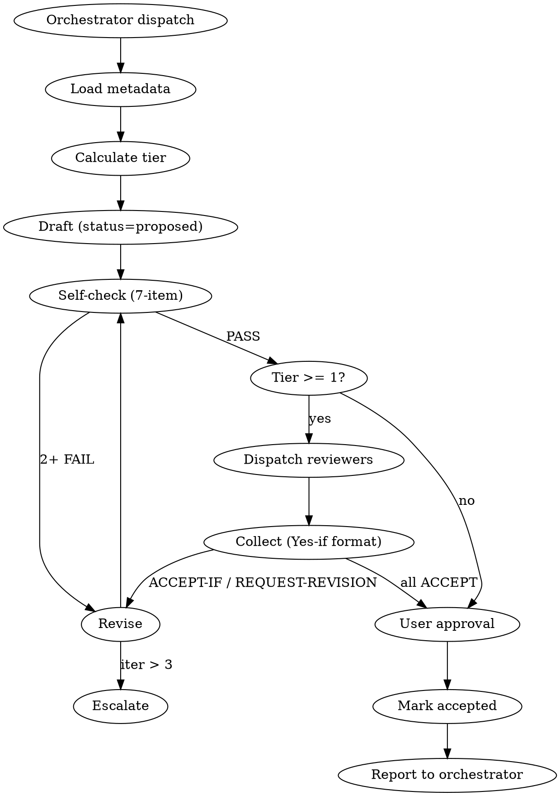

# Architect Role MD — Design Specification

## §1 Context

aigentry 에코시스템에서 **유일하게 MD 체계가 없는 프로젝트**는 `aigentry-architect`. docs/에 단일 ADR만 존재하고 CLAUDE.md / AGENTS.md 부재 상태. 이 세션은 architect 세션의 역할/경계/출력 규칙을 정의하는 **Best-Practice 기반 MD 체계**를 설계한다.

설계 범위는 단순히 architect에 국한되지 않고, 검증 후 **에코시스템 전체 MD refactor의 레퍼런스 구현**이 된다 (Track E #270-278).

## §2 Decision Summary

1. **Layered MD 구조** (cmux-style): CLAUDE.md + AGENTS.md + references/*.md + docs/
2. **3-tier 싱크 모델**: T1 (framework/rules) symlinked SSOT, T2 (defaults) copied, T3 (personal) local
3. **Output artifacts**: ADR + SPEC 이중 트랙
4. **Review process**: 4-tier 자동 결정 (frontmatter 기반)
5. **INVARIANTS**: 10 항목, Detection Signal 부가 (사전 방지)
6. **Best-practice 요소**: Red Flags, Decision Tree, Workflow digraph, Pre-submit Self-Critique, 번호 섹션, Worked Example
7. **Role-specific tiered pattern**: Core (모든 role 필수) + Optional (role 특성별 선택)

## §3 File Layout

### T1 (SSOT in devkit, symlinked to user environment)

```
aigentry-devkit/templates/aigentry-architect/
├── CLAUDE.md                       (~65 lines — session operating guide)
├── AGENTS.md                       (~280 lines — rulebook core)
└── references/
    ├── review-automation.md        (~150 lines — 4-tier logic + Yes-if + checklist)
    ├── adr-template.md             (~80 lines — ADR skeleton)
    ├── spec-template.md            (~60 lines — SPEC skeleton)
    ├── frontmatter-schema.md       (~70 lines — YAML schema + tier calc)
    ├── reviewer-matrix.md          (~60 lines — perspective diversity)
    └── constitution-check.md       (~90 lines — aigentry 헌법 §4 checklist)
```

### T3 (personal, local-only)

```
~/projects/aigentry-architect/
├── CLAUDE.md                       -> symlink to devkit template
├── AGENTS.md                       -> symlink to devkit template
├── references/                     -> symlink to devkit template
└── docs/                           (NOT symlinked — user's actual ADRs)
    ├── adr-NNNN-{slug}.md
    ├── spec-{slug}.md
    └── reviews/
        └── adr-NNNN-review-{cli}.md
```

## §4 CLAUDE.md Design (~65 lines)

**Purpose**: Session-start operating guide. Points to AGENTS.md for depth.

### Structure

```
@AGENTS.md

# CLAUDE.md — aigentry-architect

## §1 When to use this role (table: situation → ✅/❌)
## §2 Quick Start (4 steps — load INVARIANTS, FAILED, dispatch metadata, selective references/)
## §3 Red Flags (table: rationalization → reality)
## §4 Decision Tree — ADR or SPEC? (flowchart)
## §5 Communication (telepty templates — English, --ref, MANDATORY report)
## §6 Pre-submit Self-Check (7-item rubric)
```

### Best Practice Elements Applied

| Element | Rationale |
|---------|-----------|
| Red Flags table | Catches motivated reasoning before violation (superpowers pattern) |
| When/NOT to use | Role boundary clarity (cmux skill pattern) |
| Decision tree | Unambiguous ADR vs SPEC classification |
| Pre-submit rubric | Pre-emptive quality gate (Anthropic meta-prompt pattern) |
| Numbered sections §1-§6 | Cross-reference enabled (ADR-76 already uses this) |

## §5 AGENTS.md Design (~280 lines)

**Purpose**: Rulebook core. 8 numbered sections.

### Section Map

| § | Section | Lines | Purpose |
|---|---------|:-:|---------|
| §1 | Overview | 15 | Role statement + What/NOT What table |
| §2 | Role (HARD RULE) | 25 | Input/Output/Handoff contract |
| §3 | Workflow | 45 | **digraph flowchart** + step descriptions |
| §4 | Output Artifacts | 30 | ADR vs SPEC, naming, template pointers |
| §5 | INVARIANTS | 70 | **10 items × (Rule + Detection Signal + Correct Handling)** |
| §6 | FAILED APPROACHES | 40 | **Structured entries (date + root cause + lesson)** |
| §7 | Review Protocol (summary) | 25 | 4-tier quick ref, details in references/ |
| §8 | Communication | 30 | telepty templates, report format |

### 10 INVARIANTS (with Detection Signals)

| # | Rule | Detection Signal |
|---|------|------------------|
| §5.1 | NO code writing | Keyboard toward `fn`/`pub`/`function` keywords |
| §5.2 | NO file mod outside docs/ | Edit/Write target lacks `docs/` path |
| §5.3 | NO <2 alternatives | Internal monologue "this is obviously right" |
| §5.4 | NO "my preference" decisions | Decision rationale uses "~같다"/"~편이 낫다" |
| §5.5 | NO Constitution Check skip | "This doesn't touch constitution" thought |
| §5.6 | NO direct "Accepted" status | Draft with `status: accepted` temptation |
| §5.7 | NO reviewer threshold bypass | "Small change — no review needed" thought |
| §5.8 | NO backward compat skip | "No existing users affected" without evidence |
| §5.9 | NO verification plan skip | "It'll work if..." without measurement |
| §5.10 | NO ad-hoc /tmp/ files | Write tool targeting `/tmp/*.md` |

### Workflow digraph



## §6 references/ Design (6 files)

### §6.1 adr-template.md (~80 lines)
Full ADR skeleton with 10 sections: Context / Decision / Alternatives / Constitution Check / Trade-off Matrix / Backward Compat / Consequences / Verification Plan / Open Questions / Related.

### §6.2 spec-template.md (~60 lines)
Lighter skeleton for feature-level design: Goal / Scope / Approach / Files / Verification / Risks / Open Questions.

### §6.3 frontmatter-schema.md (~70 lines)
YAML field definitions + 4-tier calculation table + examples.

### §6.4 review-automation.md (~150 lines)
Full review process: 4-tier logic / Reviewer selection / "Yes, if..." format / 7-item checklist / Revision loop / Accepted transition.

### §6.5 reviewer-matrix.md (~60 lines)
Perspective diversity: 6 perspectives × 3 CLIs (claude/codex/gemini) mapping. Benchmark-validated (Track A results).

### §6.6 constitution-check.md (~90 lines)
aigentry 헌법 §4 checklist: 5 required questions + 18-article audit for `constitutional` scope.

## §7 Review Process (4-tier)

Tier calculation from frontmatter:

| type | scope | decision_type | Tier | Reviewers |
|------|-------|---------------|:-:|:-:|
| spec | local | two-way | T0 | 0 (user only) |
| spec | cross-project | two-way | T1 | 1 |
| spec | ecosystem | * | T1 | 1 |
| spec | * | one-way | T1 | 1 |
| adr | * | two-way | T2 | 2 |
| adr | ecosystem | * | T2 | 2 |
| adr | constitutional | one-way | T3 | 3 + user |

Response format (Squarespace-validated): `ACCEPT` / `ACCEPT-IF X` / `REQUEST-REVISION` / `BLOCK`.

Revision loop max 3 iterations, then escalate to user.

## §8 Risks & Mitigations

| Risk | Severity | Mitigation |
|------|:-:|-----------|
| Token budget +30% | High | Core + Tiered Optional; references/ loaded selectively |
| Over-engineering for mechanical roles | High | Role-specific pattern selection (Track E #270) |
| SSOT sync during active sessions | High | Semver pinning, explicit upgrade |
| Role-generic patterns misfit | Medium | Detection Signals role-specific, not copy-paste |
| ADR-76 retrofit cost | Medium | No retrofit — ADR-76 stays as historical reference |
| Workflow digraph confused for executable | Medium | "VISUAL AID ONLY" annotation |
| references/ Read latency | Low | Selective load; net token savings |
| User learning curve | Low | devkit/docs/ecosystem-md-best-practices.md (Track E5 #270) |

## §9 Verification Plan

| Metric | Method | Threshold |
|--------|--------|-----------|
| MD size compliance | wc -l on each file | All < 300 lines |
| Best-practice elements present | Checklist audit | 8/8 elements in architect MD |
| Session comprehension | Smoke test: spawn architect session, ask "explain your role" | Accurate summary referencing §1 Overview |
| 4-tier calculation correctness | Test 6 frontmatter examples | All produce expected tier |
| Symlink integrity | ls -la devkit → user env | No broken links |
| Trust pre-seed | bash trust-path.sh test | All aigentry-* trusted |

## §10 Open Questions

- **Q1**: 10개 모호 프로젝트 (forum/hooks/registry/...) 의 role 정체성 — Phase A/B 설문 필요 (#279/#280)
- **Q2**: Role 계층/CLI 고정/경계 겹침 등 암묵지 — Phase B 설문 (#280)
- **Q3**: ADR 실제 scale시 (10+ ADRs) 리뷰어 풀 확장 — 외부 web LLM 포함?
- **Q4**: SSOT 버전 관리 메커니즘 — semver? content-hash?
- **Q5**: Constitution (헌법) 변경 시 모든 기존 ADR 재검증 트리거?

## §11 Related

- **ADR-76** (`aigentry-architect/docs/spec-adr-76.md`): 기존 유일 ADR, Worked Example 레퍼런스
- **Track D** (태스크 큐 v2): 이 설계 진행 중 구축된 인프라
- **Track E #266-281**: 이 설계의 후속 ecosystem rollout
- **Task #264**: 이 MD 완성 후 첫 실제 활용 (MCP deliberation API spec)
